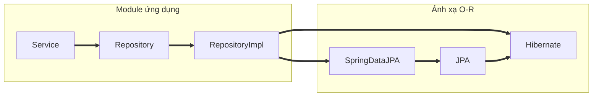
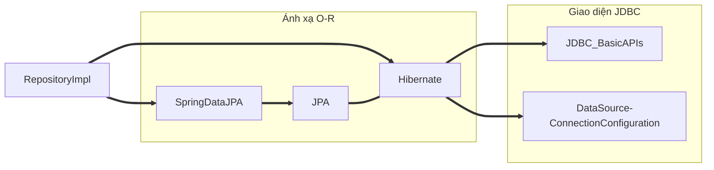
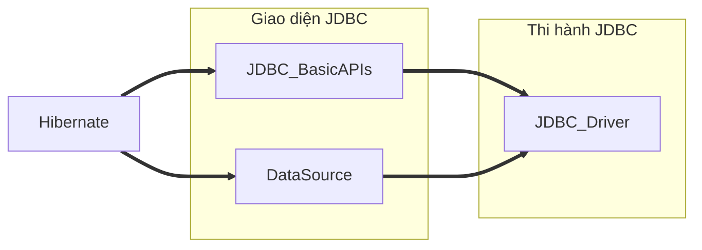
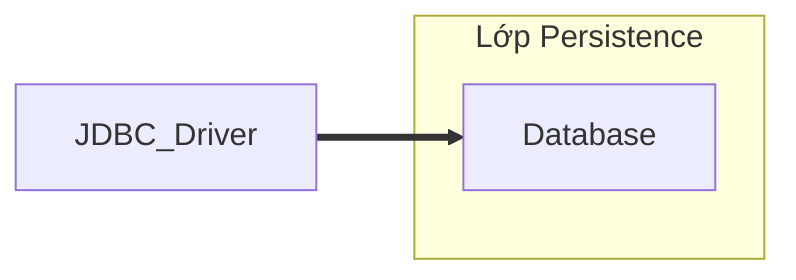

# Luồng làm việc của Spring Data JPA

## 1. Module ứng dụng

Module `Repository` mở rộng `Spring Data JPA Repository` nạp các phương thức để tương tác với cơ sở dữ liệu quan hệ (CSDLQH). Những phương thức này được thi hành trong `RepositoryImpl` thường sử dụng `EntityManager` để tạo, chạy truy vấn `JPQL`. Module `Service` xử lý business logic, định nghĩa các phương thức (VD: CRUD) và giao tiếp với module `Repository` nhờ `Dependencies Injection (DI)`. 

Khi module `Service` gọi các phương thức, thi hành của `Repository` sử dụng `EntityManager`, chú thích của JPA (`@Entity, @Id, @Column`,...) để ánh xạ tới các thực thể, bảng và các phương thức của JPA (`persist(), find(), merge(), remove()`) để tương tác với CSDLQH.

## 2. Ánh xạ Object-Relational (ORM)

JPA cung cấp các tính năng ORM, được thực hiện qua thi hành của nó (Hibernate, EclipseLink, OpenJPA). Spring Data JPA sử dụng thi hành của JPA để cung cấp `EntityManagerFactory` bean - thứ cấp giao diện `EntityManager`. `EntityManager` quản lý các persistance của POJOs (đại diện cho cột và bảng) qua đó ánh xạ các lớp và đối tượng tới bảng và thực thể.

Spring Data JPA giúp tự động thi hành giao diện trong `Repository`; truy vấn thông qua tên các phương thức; phân trang và sắp xếp dữ liệu lấy được từ CSDL; hoạt động tốt trong hệ sinh thái Spring frameworks.

## 3. Giao diện JDBC

Trong khi ORM cung cấp giải pháp từ phía các đối tượng (trừu tượng cấp cao) và lớp thì JDBC cung cấp giải pháp để kết nối với mọi hệ quản trị CSDL (các hoạt động cấp thấp). JDBC Basic APIs từ JDBC cung cấp các giao diện: 

- Connection: Chứa phương thức `Connection.createStatement()` để tạo đối tượng `Statement` và `close()` để đóng kết nối
- Statement: Chứa phương thức `executeQuery(), executeUpdate()` để thực thi các câu lệnh SQL
- ResultSet: Truy xuất kết quả truy vấn

Các cấu hình kết nối sau này được gọi bởi `EntityManager` cấu hình bên trong Data Source (URL, username, password,...)

## 4. Thi hành JDBC

JDBC driver thi hành dựa trên giao diện đã được định nghĩa:

- Kết nối được lập dựa trên cấu hình Data Source
- Gọi phương thức `Connection.createStatement()` $\rightarrow$ Đối tượng `Statement` $\rightarrow$ Các phương thức tạo câu lệnh SQL
- JDBC driver chuyển đổi những câu lệnh được gọi cho phù hợp hệ quản trị CSDL
- Kết quả được JDBC trả ngược về sau khi được chuyển đổi lại qua đối tượng `ResultSet` nhờ siêu dữ liệu
    - Lỗi nhận về qua `SQLException` nếu có

## 5. Lớp Persistence

Lớp này được thực thi bởi hệ quản trị CSDLQH, chịu trách nhiệm lưu, truy xuất thông tin. Những câu lệnh đã được dịch bởi JDBC driver sẽ được tiến hành ở đây và truy xuất kết quả để trả về cho ứng dụng hoặc lưu thông tin vào trong CSDL.

# Tham khảo

- TERASOLUNA Server Framework for Java (5.x) Development Guideline. [*5.3. Database Access (JPA)*](https://terasolunaorg.github.io/guideline/5.1.1.RELEASE/en/ArchitectureInDetail/DataAccessJpa.html).

